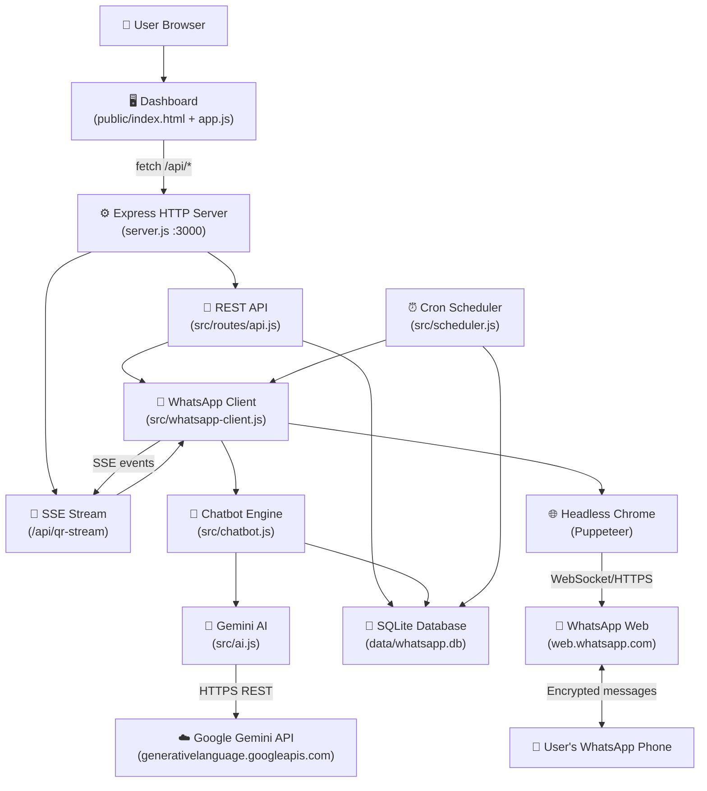
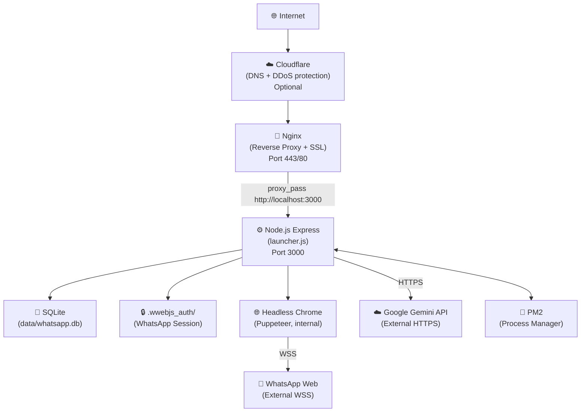

# Project Deployment & Production Readiness Analysis

**Generated:** 2026-08-07  
**Repository:** vedicagrawal12/whatsapp-automation  
**Analysis Type:** Full Codebase / Architecture / Security / DevOps / Deployment Audit  
**Analyst Role:** Senior Software Architect, DevOps Engineer, SRE, Security Engineer

---

## Table of Contents

1. [Repository Discovery](#1-repository-discovery)
2. [Project Purpose](#2-project-purpose)
3. [Technology Stack](#3-technology-stack)
4. [Architecture Analysis](#4-architecture-analysis)
5. [Application Startup Flow](#5-application-startup-flow)
6. [Environment Variables](#6-environment-variables)
7. [Dependency Analysis](#7-dependency-analysis)
8. [Database Analysis](#8-database-analysis)
9. [API Analysis](#9-api-analysis)
10. [Frontend Analysis](#10-frontend-analysis)
11. [Backend Analysis](#11-backend-analysis)
12. [Real-Time System Analysis](#12-real-time-system-analysis)
13. [External Services](#13-external-services)
14. [Security Audit](#14-security-audit)
15. [Deployment Blockers](#15-deployment-blockers)
16. [Localhost / Development Assumptions](#16-localhost--development-assumptions)
17. [Docker Readiness](#17-docker-readiness)
18. [Server Requirements](#18-server-requirements)
19. [Deployment Platform Comparison](#19-deployment-platform-comparison)
20. [Recommended Production Architecture](#20-recommended-production-architecture)
21. [Domain + HTTPS](#21-domain--https)
22. [Nginx / Reverse Proxy](#22-nginx--reverse-proxy)
23. [CI/CD](#23-cicd)
24. [Logging & Monitoring](#24-logging--monitoring)
25. [Health Checks](#25-health-checks)
26. [Backups & Disaster Recovery](#26-backups--disaster-recovery)
27. [Scalability Analysis](#27-scalability-analysis)
28. [Failure Mode Analysis](#28-failure-mode-analysis)
29. [Production Readiness Score](#29-production-readiness-score)
30. [Required Code Changes](#30-required-code-changes)
31. [Exact Deployment Plan](#31-exact-deployment-plan)
32. [Deployment Checklist](#32-deployment-checklist)
33. [Cost Analysis](#33-cost-analysis)
34. [Final Recommendation](#34-final-recommendation)

---

## 1. Repository Discovery

### Repository Tree (Annotated)

```
whatsapp-automation/
│
├── launcher.js              ← ENTRY POINT. Crash-proof wrapper; spawns server.js with exponential back-off
├── server.js                ← HTTP server. Express setup, DB init, scheduler init, WhatsApp client start
│
├── src/                     ← All backend application logic
│   ├── ai.js                ← Google Gemini AI integration; model fallback chain
│   ├── chatbot.js           ← Message processor; rule matching; AI invocation; rate limiting
│   ├── database.js          ← sql.js SQLite wrapper; schema creation; all DB helper functions
│   ├── scheduler.js         ← node-cron scheduler; sends pending scheduled messages every minute
│   ├── whatsapp-client.js   ← whatsapp-web.js Puppeteer client; QR generation; SSE broadcast; keep-alive
│   └── routes/
│       └── api.js           ← All REST API endpoints (contacts, messages, chatbot, scheduled, settings)
│
├── public/                  ← Static frontend (served directly by Express)
│   ├── index.html           ← Single-page dashboard UI (32KB — all sections inline)
│   ├── css/
│   │   └── style.css        ← All dashboard styles (40KB — custom design system)
│   └── js/
│       └── app.js           ← All frontend logic (42KB — vanilla JS SPA)
│
├── data/                    ← Runtime-generated; NOT committed to git
│   └── whatsapp.db          ← SQLite database file (created on first run)
│
├── .wwebjs_auth/            ← WhatsApp session tokens (Puppeteer); NOT committed to git
├── .wwebjs_cache/           ← Cached WhatsApp web assets; NOT committed to git
│
├── fix_db.js                ← One-time database patch script; NOT needed for normal operation
│
├── package.json             ← Node.js manifest; 10 runtime dependencies; no dev dependencies
├── package-lock.json        ← Exact locked dependency versions
├── .env                     ← Local environment config; git-ignored
├── .env.example             ← Template for new users; 3 variables only
├── .gitignore               ← Correctly excludes .env, .wwebjs_auth, data/*.db, node_modules
└── README.md                ← Setup guide

```

### Files/Directories That Must NOT Be Deployed (i.e., ignored in Docker/CI)

| Path | Reason |
|------|--------|
| `.wwebjs_auth/` | Contains your personal WhatsApp session tokens |
| `.wwebjs_cache/` | Cached WhatsApp web HTML/assets — regenerated at runtime |
| `data/whatsapp.db` | Personal database — each deployment has its own |
| `.env` | Contains secrets |
| `node_modules/` | Reinstalled from package.json on every deployment |
| `fix_db.js` | One-time migration script — not part of runtime |
| `.git/` | Version control metadata |

---

## 2. Project Purpose

### What This Application Does

*Observed from source code:*

This is a **self-hosted WhatsApp automation bot with an admin web dashboard**. It connects to a personal WhatsApp account using a QR code scan (no Meta Business account required) and then:

1. **Automatically replies** to incoming WhatsApp messages using either:
   - Google Gemini AI (acting as the account owner — "AI Persona Mode")
   - Static keyword-triggered rules (exact, contains, startswith, or regex matching)
   - A static default reply as final fallback
2. **Schedules and delivers messages** to contacts at a specified date/time
3. **Manages contacts** with labels and notes
4. **Provides a web dashboard** for monitoring conversations, configuring the bot, viewing analytics, and sending messages manually

### Feature Status Audit

| Feature | Status | Evidence |
|---------|--------|----------|
| QR Code WhatsApp login | ✅ Implemented | `whatsapp-client.js` — `client.on('qr')` handler |
| Gemini AI auto-reply | ✅ Implemented | `ai.js` — `generateReply()` with 6-model fallback chain |
| Keyword chatbot rules | ✅ Implemented | `chatbot.js` — 4 match types |
| Rate limiting (anti-ban) | ✅ Implemented | `chatbot.js` — 10 msg/min per phone |
| Human typing simulation | ✅ Implemented | `chatbot.js` — `safeReply()` random 1.5–3s delay |
| Scheduled message delivery | ✅ Implemented | `scheduler.js` — cron every minute |
| Contact management | ✅ Implemented | `database.js` + `api.js` |
| Message logging | ✅ Implemented | `database.js` — `logMessage()` |
| Real-time QR/status updates | ✅ Implemented | SSE stream at `/api/qr-stream` |
| Dashboard analytics | ✅ Implemented | `getDashboardStats()` — 7-day chart data |
| Settings saved to DB | ✅ Implemented | `settings` table in SQLite |
| Crash-proof launcher | ✅ Implemented | `launcher.js` — exponential back-off |
| Away mode | ✅ Implemented | Settings toggle + `away_message` |
| "Clear messages" button | ⚠️ Partially | Frontend shows toast "not yet implemented" (`app.js:890`) |
| "Disconnect WhatsApp" button | ⚠️ Partially | Frontend says "restart the server" — no API endpoint (`app.js:893`) |
| Dashboard authentication/login | ❌ NOT Implemented | No auth middleware anywhere in codebase |
| Meta Cloud API / Webhooks | ❌ Removed (dead code deleted) | `whatsapp.js` and `webhook.js` deleted from repo |
| Analytics charting | ✅ Implemented (data) | `messagesByDay` returned; rendered via inline SVG in HTML |
| HTTPS | ❌ Not configured | No TLS anywhere; requires external reverse proxy |

---

## 3. Technology Stack

### Frontend

| Item | Detail |
|------|--------|
| Framework | None — **Vanilla JavaScript SPA** |
| Build system | None — raw static files served by Express |
| Package manager | N/A (no frontend build step) |
| UI libraries | None — custom CSS design system (`style.css`) |
| State management | Simple module-level variables (`currentSection`) |
| API client | Native `fetch()` with relative URLs |
| Real-time | **Server-Sent Events (SSE)** via `EventSource('/api/qr-stream')` |
| Authentication | ❌ None |
| Font | System default (no Google Fonts import observed) |

### Backend

| Item | Detail |
|------|--------|
| Language | **Node.js** |
| Runtime version | v18+ required (uses `fetch()` natively); tested on v25.8.2 |
| Framework | **Express.js 4.22.2** |
| API architecture | REST + SSE |
| Entry point | `node launcher.js` → spawns `node server.js` |
| Application server | Express built-in HTTP server (`app.listen`) |
| Middleware | `cors`, `morgan`, `express.json`, `express.urlencoded`, `express.static` |
| Authentication | ❌ None — all routes are publicly accessible |
| Background tasks | `node-cron` scheduler (1-minute interval) |
| Async architecture | Async/await; `Promise.race()` for timeouts |

### Database

| Item | Detail |
|------|--------|
| Engine | **SQLite** via **sql.js** (WebAssembly SQLite, in-memory + file persistence) |
| ORM | None — raw SQL with prepared statements |
| Schema | Created automatically on first run via `CREATE TABLE IF NOT EXISTS` |
| Connection | Single in-memory db instance (`db` module variable); persisted to file after each write |
| Pooling | ❌ None — single-threaded Node.js, single db instance |
| File path | `./data/whatsapp.db` (relative to project root) |

### AI/ML

| Item | Detail |
|------|--------|
| Provider | **Google Gemini API** (external) |
| Library | `@google/genai` v2.16.0 |
| Models (in priority order) | `gemini-3.5-flash`, `gemini-3.6-flash`, `gemini-flash-latest`, `gemini-pro-latest`, `gemini-2.0-flash-lite`, `gemini-2.0-flash` |
| GPU | ❌ Not required (remote API inference) |
| Key storage | SQLite `settings` table (primary) or `GEMINI_API_KEY` env var (fallback) |
| Failure behavior | Tries 6 models in sequence; if all fail, falls through to keyword rules or default reply |
| Expected latency | 1–5 seconds per message (network-dependent) |

### Infrastructure

| Component | Status |
|-----------|--------|
| Redis | ❌ Not used |
| Message queue | ❌ Not used |
| Worker processes | ❌ Not used (single Node.js process) |
| WebSockets | ❌ Not used (SSE instead) |
| Reverse proxy | ❌ Not configured (required for production) |
| Docker | ❌ No Dockerfile exists |
| CI/CD | ❌ No workflow files exist |
| Monitoring | ❌ Not configured |

---

## 4. Architecture Analysis

### How Components Communicate

- **Frontend → Backend**: Relative `fetch()` calls (e.g., `/api/messages`) — works because frontend is served by the same Express server on the same origin. No CORS issues in same-origin setup.
- **Backend → Database**: Module-level singleton `db` object (sql.js in-memory). Every write calls `persist()` which syncs to disk via `fs.writeFileSync`. No async I/O on reads/writes.
- **Backend → WhatsApp**: `whatsapp-web.js` drives a headless Chromium/Chrome browser via Puppeteer. The browser connects to `web.whatsapp.com` and emulates the WhatsApp Web session.
- **Backend → Gemini AI**: HTTPS REST calls via `@google/genai` SDK to `generativelanguage.googleapis.com`.
- **Backend → Frontend (real-time)**: SSE stream at `/api/qr-stream`. Events: `qr`, `ready`, `disconnected`, `loading`, `error`.

### Architecture Diagram



---

## 5. Application Startup Flow

### Startup Sequence

```
npm run dev / npm start
       │
       ▼
launcher.js (restartCount++, spawn child)
       │
       ▼
server.js (child process)
       │
       ├─ 1. Load dotenv (.env file)
       │
       ├─ 2. Register global error handlers
       │    (uncaughtException, unhandledRejection, SIGINT, SIGTERM)
       │
       ├─ 3. Set up Express app
       │    (cors, morgan, json parser, static files from /public)
       │
       ├─ 4. Register API routes (/api/*)
       │
       ├─ 5. await initDatabase()
       │    - Load or create data/whatsapp.db
       │    - Run CREATE TABLE IF NOT EXISTS for all 5 tables
       │    - INSERT OR IGNORE default settings
       │    - persist() to disk
       │    ❌ If fails → process.exit(1) → launcher restarts
       │
       ├─ 6. initScheduler()
       │    - Start node-cron '* * * * *' task
       │    - Non-fatal if fails
       │
       ├─ 7. app.listen(PORT)
       │    - Binds to 0.0.0.0:3000 (Express default)
       │    ❌ If EADDRINUSE → process.exit(1) → launcher restarts
       │
       └─ 8. initWhatsAppClient()
            - clearStaleLocks() — delete Chromium lock files
            - new Client({ puppeteer: { headless: true } })
            - client.initialize()
            - Browser launches, loads WhatsApp Web
            - Emits 'qr' event → generates QR code → SSE broadcast
            - User scans QR code on phone
            - Emits 'ready' → bot is active
            ❌ If fails → scheduleRestart() with exponential back-off
```

### Initialization Dependency Order

| Step | Dependency | Failure Behavior |
|------|-----------|-----------------|
| Database | Filesystem write access to `./data/` | Fatal — process exits, launcher restarts |
| Scheduler | Database initialized | Non-fatal — server stays up, no scheduling |
| HTTP server | Port 3000 available | Fatal — process exits, launcher restarts |
| WhatsApp client | Network access to web.whatsapp.com; Chrome binary | Non-fatal — retries with back-off; dashboard still accessible |
| Gemini AI | Valid API key in DB or env | Non-fatal — falls back to rules/default reply |

---

## 6. Environment Variables

*Observed from scanning entire codebase:*

| Variable | Used By | Required? | Purpose | Secret? | Default | Notes |
|----------|---------|-----------|---------|---------|---------|-------|
| `PORT` | `server.js:43` | No | HTTP server port | No | `3000` | Set in `.env` |
| `GEMINI_API_KEY` | `src/ai.js:8` | No* | Gemini AI fallback if not set in DB | Yes | None | *Primary source is DB `settings` table |
| `DEMO_MODE` | `server.js` (dotenv loaded) | No | Undocumented; referenced in old deleted code | No | `false` | **Currently unused** after webhook.js deletion |
| `NODE_ENV` | Not explicitly used | No | Not referenced in source | No | N/A | Would be useful to add |

### Key Findings

- **Only 1 env var is actually used at runtime**: `PORT` and `GEMINI_API_KEY`
- **`DEMO_MODE`** is now orphaned — it was only used by the deleted `whatsapp.js` and `webhook.js` files. It is completely unused and can be removed from `.env.example`.
- **The Gemini API key is primarily stored in the SQLite database** (entered via the Settings dashboard). The `.env` `GEMINI_API_KEY` is only a fallback, making `.env` almost optional.
- **No hardcoded secrets detected** in source files.
- **No Windows-specific paths detected** in source files (all paths use `path.join()` correctly).

---

## 7. Dependency Analysis

### Runtime Dependencies (from package-lock.json)

| Package | Version | Purpose | Notes |
|---------|---------|---------|-------|
| `express` | 4.22.2 | HTTP server framework | Stable |
| `whatsapp-web.js` | 1.34.7 | WhatsApp Web automation via Puppeteer | ⚠️ Unofficial — may break if WhatsApp changes their web app |
| `@google/genai` | 2.16.0 | Google Gemini AI SDK | Pinned to `latest` in package.json — risky |
| `sql.js` | 1.14.1 | SQLite via WebAssembly | Stable; no native compilation needed |
| `node-cron` | 3.0.3 | Cron job scheduler | Stable |
| `qrcode` | 1.5.4 | QR code generation (data URLs) | Stable |
| `cors` | 2.8.6 | CORS middleware | Configured with wildcard `*` |
| `morgan` | 1.11.0 | HTTP request logging | Dev-style logging in production |
| `dotenv` | 16.6.1 | `.env` file loader | Stable |
| `axios` | 1.19.0 | HTTP client | ⚠️ Only used by deleted webhook.js — now UNUSED |

### Issues Found

| Issue | Package | Severity | Detail |
|-------|---------|---------|--------|
| Pinned to `latest` | `@google/genai` | HIGH | `"latest"` in package.json means future installs may get breaking API changes |
| Unused dependency | `axios` | LOW | Only used by deleted `whatsapp.js`. Can be removed |
| Unofficial API risk | `whatsapp-web.js` | MEDIUM | WhatsApp can change web protocol at any time, breaking the bot |
| No dev dependencies | — | LOW | No test framework, no linter, no formatter |
| morgan in production | `morgan` | LOW | Logs every HTTP request to stdout with timing; noisy in production |

### OS-Level Dependencies (Critical for Linux Servers)

`whatsapp-web.js` uses Puppeteer which bundles Chromium but requires system libraries. On a fresh Ubuntu/Debian server, you **must** install:

```bash
sudo apt-get install -y ca-certificates fonts-liberation libasound2 libatk-bridge2.0-0 \
  libatk1.0-0 libc6 libcairo2 libcups2 libdbus-1-3 libexpat1 libfontconfig1 libgbm1 \
  libgcc1 libglib2.0-0 libgtk-3-0 libnspr4 libnss3 libpango-1.0-0 libpangocairo-1.0-0 \
  libstdc++6 libx11-6 libx11-xcb1 libxcb1 libxcomposite1 libxcursor1 libxdamage1 \
  libxext6 libxfixes3 libxi6 libxrandr2 libxrender1 libxss1 libxtst6 wget xdg-utils
```

This is the **#1 reason deployments fail on fresh Linux servers**.

---

## 8. Database Analysis

### Engine

**SQLite** via **sql.js** (SQLite compiled to WebAssembly). This is an in-memory database that is manually serialized to disk after every write operation.

### Architecture Note (Important)

Unlike standard SQLite drivers (like `better-sqlite3`) which read/write the file directly, `sql.js` loads the entire database into RAM on startup, then calls `fs.writeFileSync()` on every write. This means:

- **Reads are extremely fast** (in-memory)
- **Writes are slower than standard SQLite** (full DB export + sync on every change)
- **Data is safe** as long as `persist()` completes before a crash
- **RAM usage grows** as the database grows

### Schema

```
contacts
├── id              INTEGER PK AUTOINCREMENT
├── phone           TEXT UNIQUE NOT NULL
├── name            TEXT DEFAULT ''
├── label           TEXT DEFAULT ''
├── notes           TEXT DEFAULT ''
├── created_at      DATETIME DEFAULT CURRENT_TIMESTAMP
└── updated_at      DATETIME DEFAULT CURRENT_TIMESTAMP

messages
├── id              INTEGER PK AUTOINCREMENT
├── wa_message_id   TEXT
├── phone           TEXT NOT NULL
├── contact_name    TEXT DEFAULT ''
├── direction       TEXT CHECK(direction IN ('incoming', 'outgoing'))
├── message_type    TEXT DEFAULT 'text'
├── body            TEXT DEFAULT ''
├── status          TEXT DEFAULT 'sent'
├── template_name   TEXT
└── created_at      DATETIME DEFAULT CURRENT_TIMESTAMP

chatbot_rules
├── id              INTEGER PK AUTOINCREMENT
├── trigger_keyword TEXT NOT NULL
├── match_type      TEXT CHECK(match_type IN ('exact','contains','startswith','regex'))
├── response_text   TEXT NOT NULL
├── priority        INTEGER DEFAULT 0
├── is_active       INTEGER DEFAULT 1
├── hit_count       INTEGER DEFAULT 0
├── created_at      DATETIME DEFAULT CURRENT_TIMESTAMP
└── updated_at      DATETIME DEFAULT CURRENT_TIMESTAMP

scheduled_messages
├── id              INTEGER PK AUTOINCREMENT
├── phone           TEXT NOT NULL
├── body            TEXT NOT NULL
├── scheduled_at    DATETIME NOT NULL
├── status          TEXT CHECK(status IN ('pending','sent','failed','cancelled'))
├── error_message   TEXT
├── created_at      DATETIME DEFAULT CURRENT_TIMESTAMP
└── sent_at         DATETIME

settings
├── key             TEXT PK
└── value           TEXT NOT NULL
```

### Indexes

- `idx_messages_phone` — fast conversation lookup by phone
- `idx_messages_created` — fast time-ordered queries
- `idx_messages_direction` — fast incoming/outgoing filter
- `idx_scheduled_status` — fast pending message lookup
- `idx_contacts_phone` — fast contact lookup

### Default Settings Inserted on First Run

| Key | Default Value |
|-----|---------------|
| `chatbot_enabled` | `true` |
| `default_reply` | `Thank you for your message! I will get back to you shortly. 🙏` |
| `business_name` | `Personal Assistant` |
| `owner_name` | _(empty)_ |
| `ai_mode` | `ai_first` |
| `away_message` | _(a default away text)_ |
| `away_mode` | `false` |
| `ai_enabled` | `true` |
| `ai_system_prompt` | _(detailed default prompt)_ |

### Potential Issues

| Issue | Severity | Detail |
|-------|---------|--------|
| No migration system | MEDIUM | Schema changes require manual fix scripts (as seen with `fix_db.js`) |
| Full DB written on every change | MEDIUM | With high message volumes, `fs.writeFileSync` becomes a bottleneck |
| Single-file SQLite not suited for multi-instance | HIGH | Cannot run 2 server instances simultaneously against the same db file |
| No backup automation | MEDIUM | If `data/` directory is wiped, all history is lost |
| Gemini API key stored in DB | MEDIUM | DB file contains the Gemini API key in plaintext |

---

## 9. API Analysis

### Endpoint Inventory

| Method | Endpoint | Purpose | Auth | Input | Output |
|--------|----------|---------|------|-------|--------|
| GET | `/api/dashboard/stats` | Dashboard stats & recent messages | ❌ None | — | JSON stats object |
| GET | `/api/status` | WhatsApp connection status | ❌ None | — | `{connected, phone}` |
| GET | `/api/qr-stream` | SSE stream for QR/connection state | ❌ None | — | SSE event stream |
| GET | `/api/contacts` | List contacts | ❌ None | `?search=&label=` | Array of contacts |
| POST | `/api/contacts` | Add/update contact | ❌ None | `{phone, name, label, notes}` | Contact object |
| DELETE | `/api/contacts/:id` | Delete contact | ❌ None | URL param `id` | `{success: true}` |
| GET | `/api/messages` | List messages | ❌ None | `?phone=&direction=&limit=&offset=` | Array of messages |
| GET | `/api/messages/conversation/:phone` | Conversation history | ❌ None | URL param `phone` | Array of messages |
| POST | `/api/messages/send` | Send WhatsApp message immediately | ❌ None | `{phone, body}` | Send result |
| GET | `/api/chatbot/rules` | List all chatbot rules | ❌ None | — | Array of rules |
| POST | `/api/chatbot/rules` | Create chatbot rule | ❌ None | `{trigger_keyword, match_type, response_text, priority}` | Rule object |
| PUT | `/api/chatbot/rules/:id` | Update chatbot rule | ❌ None | Partial rule fields | Result |
| DELETE | `/api/chatbot/rules/:id` | Delete chatbot rule | ❌ None | URL param `id` | `{success: true}` |
| POST | `/api/chatbot/test` | Test message against rules | ❌ None | `{message}` | Match result |
| GET | `/api/scheduled` | List scheduled messages | ❌ None | `?status=` | Array |
| POST | `/api/scheduled` | Schedule a message | ❌ None | `{phone, body, scheduled_at}` | Scheduled message |
| DELETE | `/api/scheduled/:id` | Cancel scheduled message | ❌ None | URL param `id` | `{success: true}` |
| GET | `/api/settings` | Get all settings | ❌ None | — | Settings object |
| PUT | `/api/settings` | Update settings | ❌ None | `{key: value}` | Updated settings |
| GET | `/health` | Server health check | ❌ None | — | `{status, uptime, pid}` |

### Critical API Security Issues

> ⚠️ **EVERY SINGLE API ENDPOINT IS PUBLICLY ACCESSIBLE WITH NO AUTHENTICATION.**
> 
> Anyone who discovers the server's IP address and port can:
> - Read all your WhatsApp messages
> - Send WhatsApp messages from your account
> - Change all bot settings including the Gemini API key
> - Delete all contacts and messages
> - Read your scheduled messages

---

## 10. Frontend Analysis

### How It Is Built and Served

- **No build step** — raw HTML/CSS/JS files.
- Express serves `public/` as static files via `express.static()`.
- Frontend and backend run on the **same origin** (same server, same port).
- API calls use relative paths (e.g., `/api/messages`) — correct and portable.
- SSE uses relative path (`/api/qr-stream`) — correct.

### Frontend Assessment

| Item | Status |
|------|--------|
| No build tool required | ✅ Good for simplicity |
| Single `index.html` with all sections | ✅ Simple SPA approach |
| `escapeHtml()` prevents XSS | ✅ Correctly implemented |
| Error banners with retry | ✅ User-friendly |
| Mobile responsive (sidebar) | ✅ Implemented |
| Hardcoded `en-IN` locale for dates | ⚠️ India-specific; others may see unexpected date format |
| No authentication UI | ❌ Critical — no login page |
| `API = ''` (relative URL) | ✅ Correct for same-server deployment |

### Deployment Recommendation

Since the frontend has no build step and is served by Express, it **does not** need a separate hosting service. The recommended deployment is:

**Single server** running Express, with Nginx as a reverse proxy in front. Nginx handles SSL termination and forwards all traffic to Express on port 3000. The frontend files are served by Express's `express.static()` middleware.

---

## 11. Backend Analysis

### Entry Point and Commands

| Command | Result |
|---------|--------|
| `npm run dev` | Runs `node launcher.js` |
| `npm start` | Runs `node launcher.js` (same) |
| `npm run server` | Runs `node server.js` directly (bypasses crash recovery) |

**Correct production command**: `npm start` (or `node launcher.js`)

### Server Binding

*Observed:* `app.listen(PORT)` — Express defaults to binding on `0.0.0.0` (all interfaces), which is correct for a server behind a reverse proxy.

### Concurrency Model

- Single Node.js event loop
- Single Express process
- Single WhatsApp client (one connected phone number at a time)
- No worker threads, no cluster mode
- All I/O is async/await
- Database I/O is **synchronous** (sql.js is sync)

### CORS Configuration

*Observed in `server.js`:* `app.use(cors())` — **wildcard CORS with no origin restriction**. In a same-origin setup this doesn't matter, but if an API URL is ever exposed publicly, any website could make cross-origin requests to it.

---

## 12. Real-Time System Analysis

### Server-Sent Events (SSE)

*Observed:* One SSE endpoint at `/api/qr-stream`.

| Aspect | Detail |
|--------|--------|
| Protocol | HTTP/1.1 SSE (`text/event-stream`) |
| Direction | Server → Browser only (one-way) |
| Connection type | Long-lived HTTP connection |
| Events sent | `qr` (QR code data URL), `ready` (phone connected), `disconnected`, `loading`, `error` |
| Heartbeat | Every 20 seconds (`: heartbeat\n\n`) to keep connection alive through proxies |
| Reconnection | Browser's `EventSource` auto-reconnects |
| Nginx requirement | Must set `proxy_buffering off` and `X-Accel-Buffering: no` headers |

### Production Nginx Configuration for SSE

SSE requires specific Nginx directives (provided in Section 22).

---

## 13. External Services

| Service | Purpose | Required? | Auth Method | Failure Impact |
|---------|---------|-----------|-------------|----------------|
| **Google Gemini API** | AI message generation | No (has fallbacks) | API key (in DB or env) | Falls back to keyword rules → default reply. Bot still works |
| **WhatsApp Web** (`web.whatsapp.com`) | Actual WhatsApp communication | YES | QR code session (stored in `.wwebjs_auth/`) | Bot cannot send/receive any messages |
| **GitHub raw content** (wppconnect-team/wa-version) | WhatsApp Web HTML version cache | No (Puppeteer downloads as fallback) | None | Slower startup; still works |
| **npm registry** | Dependency installation | Only at deploy time | None | Cannot install dependencies without it |

---

## 14. Security Audit

### 🔴 CRITICAL

**C1 — No Authentication on Any Endpoint**
- **Location**: `src/routes/api.js` — all routes; `server.js` — no auth middleware
- **Problem**: The dashboard and every API endpoint are completely publicly accessible. No login, no password, no token, no session.
- **Risk**: Anyone who discovers your server IP can read all WhatsApp messages, send messages from your account, modify your AI persona, and extract your Gemini API key.
- **Production Impact**: Complete account takeover and data breach.
- **Fix**: Add session-based authentication middleware before all `/api` routes. A simple Express session with a configurable admin password stored in `.env` is sufficient for this use case.

**C2 — Gemini API Key Stored in Plaintext in Database**
- **Location**: `src/database.js` — `settings` table; `src/ai.js:8`
- **Problem**: The Gemini API key is stored as a plain text value in the SQLite settings table. Anyone with filesystem access or API access (C1) can read it.
- **Production Impact**: API key theft; unauthorized AI API usage billed to your account.
- **Fix**: At minimum, protect the database file with filesystem permissions. Long-term, use environment variable only (remove from DB storage).

### 🟠 HIGH

**H1 — Wildcard CORS**
- **Location**: `server.js:46` — `app.use(cors())`
- **Problem**: CORS is configured with default wildcard `*`, allowing any origin to make API requests.
- **Production Impact**: Combined with C1, any malicious website can trigger API calls to your server from a victim's browser.
- **Fix**: Restrict to known origin: `app.use(cors({ origin: 'https://yourdomain.com' }))` or remove CORS entirely since frontend and backend are same-origin.

**H2 — No Input Validation on Message Send**
- **Location**: `src/routes/api.js:98` — `/api/messages/send`
- **Problem**: The phone number field is passed directly to WhatsApp's `sendMessage`. No format validation, no allowlist, no rate limiting on this endpoint.
- **Production Impact**: Bot can be used to spam arbitrary phone numbers.
- **Fix**: Validate phone number format (E.164); add per-IP rate limiting.

**H3 — Morgan Logging in Production May Log Sensitive Data**
- **Location**: `server.js:47` — `app.use(morgan('dev'))`
- **Problem**: `morgan('dev')` logs all HTTP requests including URL paths (which may contain phone numbers) to stdout. No log rotation.
- **Production Impact**: Logs may contain personal phone numbers; logs fill disk.
- **Fix**: Use `morgan('combined')` format with log rotation; filter sensitive query params.

### 🟡 MEDIUM

**M1 — No HTTPS**
- **Location**: Entire application
- **Problem**: No TLS configured. WhatsApp QR codes and all data sent in plaintext if accessed over a network.
- **Fix**: Nginx + Let's Encrypt (described in Section 22).

**M2 — No Rate Limiting on API Endpoints**
- **Location**: `src/routes/api.js` — all endpoints
- **Problem**: No rate limiting on REST API endpoints. Only per-phone chatbot rate limiting exists.
- **Fix**: Add `express-rate-limit` middleware to API routes.

**M3 — `fix_db.js` Disables All Chatbot Rules**
- **Location**: `fix_db.js:40` — `db.run("UPDATE chatbot_rules SET is_active = 0")`
- **Problem**: This script, if run accidentally, disables all chatbot rules. It's in the repo root with no guard.
- **Production Impact**: Silent disruption of chatbot.
- **Fix**: Add a confirmation prompt or delete the file from the repo.

### 🟢 LOW

**L1 — `axios` Unused Dependency**
- **Location**: `package.json`
- **Problem**: `axios` remains after deleting the files that used it.
- **Fix**: `npm uninstall axios`

**L2 — `DEMO_MODE` Env Variable Orphaned**
- **Location**: `.env.example`, `server.js` (via dotenv)
- **Problem**: `DEMO_MODE` is loaded by dotenv but no longer referenced in any source file.
- **Fix**: Remove from `.env.example` and `.env`.

**L3 — No Content Security Policy Headers**
- **Location**: `server.js` — no security headers middleware
- **Problem**: No CSP, X-Frame-Options, or other security headers set.
- **Fix**: Add `helmet` middleware.

---

## 15. Deployment Blockers

| # | Blocker | Severity | Component | Why It Blocks | Required Fix |
|---|---------|---------|-----------|---------------|-------------|
| 1 | **No authentication** | 🔴 CRITICAL | All API routes | Anyone can control your WhatsApp account | Add login middleware before deploying publicly |
| 2 | **OS-level Chrome dependencies missing** | 🔴 CRITICAL | `whatsapp-client.js` | Puppeteer won't start on a fresh Linux server | `apt-get install` required system libraries |
| 3 | **No persistent storage on ephemeral hosts** | 🔴 CRITICAL | `data/whatsapp.db`, `.wwebjs_auth/` | Render/Heroku free tiers wipe filesystem on restart | Use VPS with persistent disk |
| 4 | **No Dockerfile** | 🟠 HIGH | Entire app | Cannot deploy to container platforms without writing one | Create Dockerfile |
| 5 | **CORS wildcard** | 🟠 HIGH | `server.js` | Allows cross-origin requests from any site | Restrict to known origin |
| 6 | **No HTTPS configuration** | 🟠 HIGH | Networking | Credentials and QR codes transmitted in plaintext | Configure Nginx + Let's Encrypt |
| 7 | **No reverse proxy config** | 🟠 HIGH | Networking | Port 3000 must not be directly exposed; SSE needs proxy config | Configure Nginx |
| 8 | **`axios` unused dep** | 🟢 LOW | `package.json` | Minor — unnecessary weight | `npm uninstall axios` |
| 9 | **No process manager** | 🟡 MEDIUM | Deployment | `launcher.js` handles crashes but not system reboots | Use `pm2` or `systemd` to survive server restarts |
| 10 | **No CI/CD** | 🟡 MEDIUM | DevOps | Manual deployment process is error-prone | Optional but recommended |

---

## 16. Localhost / Development Assumptions

*Observed from full codebase scan:*

| Location | Assumption | Production Impact |
|----------|-----------|-----------------|
| `public/js/app.js:5` — `const API = ''` | Relative URL assumes same origin | ✅ Correct for production behind reverse proxy |
| `public/js/app.js:537` — `new EventSource('/api/qr-stream')` | Relative URL | ✅ Correct |
| `src/whatsapp-client.js:115` — `dataPath: './.wwebjs_auth'` | Relative path | ✅ Works if CWD is project root; `launcher.js` sets `cwd: __dirname` |
| `src/database.js:6,11` — `path.join(__dirname, '..', 'data')` | Relative to `src/` | ✅ Resolves correctly |
| `server.js:43` — `process.env.PORT \|\| 3000` | Default port 3000 | ✅ Overridable via env var |
| Webversion cache URL in `whatsapp-client.js` | External GitHub raw URL | ⚠️ Requires internet access from server |

**No hardcoded `localhost` or `127.0.0.1` found in source files.**  
All paths use `path.join(__dirname, ...)` correctly — cross-platform compatible.

---

## 17. Docker Readiness

*Observed:* **No Dockerfile exists** in the repository.

### Recommended Dockerfile

```dockerfile
FROM node:20-slim

# Install Chromium system dependencies
RUN apt-get update && apt-get install -y \
    ca-certificates fonts-liberation libasound2 libatk-bridge2.0-0 \
    libatk1.0-0 libc6 libcairo2 libcups2 libdbus-1-3 libexpat1 \
    libfontconfig1 libgbm1 libgcc1 libglib2.0-0 libgtk-3-0 libnspr4 \
    libnss3 libpango-1.0-0 libpangocairo-1.0-0 libstdc++6 libx11-6 \
    libx11-xcb1 libxcb1 libxcomposite1 libxcursor1 libxdamage1 libxext6 \
    libxfixes3 libxi6 libxrandr2 libxrender1 libxss1 libxtst6 wget xdg-utils \
    --no-install-recommends && rm -rf /var/lib/apt/lists/*

WORKDIR /app

# Install dependencies first (layer caching)
COPY package*.json ./
RUN npm ci --only=production

# Copy source
COPY launcher.js server.js fix_db.js ./
COPY src/ ./src/
COPY public/ ./public/

# Create data directory
RUN mkdir -p data

# Run as non-root user
RUN groupadd -r appuser && useradd -r -g appuser appuser
RUN chown -R appuser:appuser /app
USER appuser

EXPOSE 3000

HEALTHCHECK --interval=30s --timeout=10s --start-period=60s --retries=3 \
  CMD wget -qO- http://localhost:3000/health || exit 1

CMD ["node", "launcher.js"]
```

### Required Volumes (CRITICAL)

```yaml
volumes:
  - ./data:/app/data                  # SQLite database persistence
  - ./wwebjs_auth:/app/.wwebjs_auth   # WhatsApp session persistence
```

**Without these volumes, the database and WhatsApp session are lost on every container restart.**

---

## 18. Server Requirements

### Why Resources Are Needed

- **Puppeteer/Chrome**: Each headless Chrome instance uses 150–400MB RAM
- **Node.js**: Base overhead ~50–100MB RAM
- **sql.js**: Entire database loaded into RAM (grows with message volume)
- **WhatsApp web protocol**: Continuous WebSocket connection; low CPU at idle

### Minimum (Single user, personal bot)

| Resource | Minimum |
|----------|---------|
| CPU | 1 vCPU |
| RAM | **1 GB** (Chrome needs ~300MB alone) |
| Storage | 10 GB |
| Network | Any with outbound internet access |
| OS | Ubuntu 22.04 LTS |

### Recommended (Reliable production)

| Resource | Recommended |
|----------|-------------|
| CPU | 2 vCPU |
| RAM | **2 GB** (comfortable headroom) |
| Storage | 20 GB SSD |
| Network | Static IP + 100Mbps |

### Note on "High Load"

This architecture (single Node.js process, single WhatsApp account) **cannot horizontally scale** beyond one instance. The bottleneck is the single WhatsApp Web session and the single-file SQLite database. For high traffic, a complete architectural rewrite would be required.

---

## 19. Deployment Platform Comparison

| Platform | Compatibility | Complexity | Est. Cost | Pros | Cons |
|----------|-------------|-----------|-----------|------|------|
| **VPS (Hetzner/DigitalOcean)** | ✅ Full | Medium | $4–12/mo | Full control; persistent disk; reliable | Manual server management |
| **Google Cloud e2-micro** | ✅ Full | Medium | **Free** (Always Free tier) | Permanent free; 30GB disk; Google reliability | US regions only for free |
| **Oracle Cloud Free** | ✅ Full | Medium | **Free** | 4 cores + 24GB RAM free; largest free tier | Complex sign-up |
| **Railway** | ✅ (with paid disk) | Low | $5–15/mo | Easy deploy from GitHub; persistent disk add-on | Costs money for disk |
| **Render Free** | ⚠️ Partial | Low | Free | Easy | Ephemeral disk; app sleeps after 15min inactivity |
| **Vercel / Netlify** | ❌ | N/A | N/A | — | Serverless; no persistent process; no filesystem |
| **Heroku** | ⚠️ Partial | Low | $7+/mo | Easy | Ephemeral filesystem; WhatsApp session lost on dyno restart |
| **Fly.io** | ✅ Full | Medium | $3–10/mo | Persistent volumes; global regions; Docker-native | Requires Dockerfile |

### Recommendations

| Scenario | Recommended Platform | Reason |
|----------|---------------------|--------|
| **Best free deployment** | Google Cloud e2-micro | Always-Free tier; permanent disk; reliable |
| **Best low-cost production** | Hetzner CX22 VPS (~$4/mo) | Cheap, fast SSD, full control, EU/US locations |
| **Best serious production** | DigitalOcean Droplet ($12/mo) | Excellent documentation; managed backups; simple UI |

---

## 20. Recommended Production Architecture



### Recommended Text Architecture

```
Internet
   │
   ├── (Optional) Cloudflare — DNS, CDN, DDoS protection
   │
Nginx (port 80/443, Let's Encrypt SSL)
   │
   ├── Proxies all traffic → localhost:3000
   ├── SSE: proxy_buffering off
   └── Security headers

Node.js Express (port 3000, bound localhost only)
   │
   ├── Serves public/ (static files)
   ├── REST API (/api/*)
   ├── SSE stream (/api/qr-stream)
   │
   ├── SQLite database (data/whatsapp.db) — persistent volume
   ├── WhatsApp session (.wwebjs_auth/) — persistent volume
   └── Headless Chrome (Puppeteer) — internal process

PM2 (process manager)
   └── Restarts Node on server reboot
```

---

## 21. Domain + HTTPS

### Recommended Setup

1. **Domain**: Purchase from Namecheap, Cloudflare, or similar. Example: `yourbot.example.com`
2. **DNS**: Point A record to your server's public IP
3. **SSL**: Use Certbot + Let's Encrypt (free)

```bash
# Install certbot
sudo apt install certbot python3-certbot-nginx

# Obtain certificate (replace with your domain)
sudo certbot --nginx -d yourbot.example.com

# Certbot auto-renews — verify:
sudo certbot renew --dry-run
```

4. **CORS**: Update `server.js` to restrict CORS to your domain after enabling HTTPS.

---

## 22. Nginx / Reverse Proxy

### Production-Ready Nginx Configuration

```nginx
# /etc/nginx/sites-available/whatsapp-bot

server {
    listen 80;
    server_name yourbot.example.com;
    return 301 https://$host$request_uri;
}

server {
    listen 443 ssl http2;
    server_name yourbot.example.com;

    ssl_certificate     /etc/letsencrypt/live/yourbot.example.com/fullchain.pem;
    ssl_certificate_key /etc/letsencrypt/live/yourbot.example.com/privkey.pem;
    ssl_protocols       TLSv1.2 TLSv1.3;

    # Security headers
    add_header X-Frame-Options SAMEORIGIN;
    add_header X-Content-Type-Options nosniff;
    add_header X-XSS-Protection "1; mode=block";
    add_header Strict-Transport-Security "max-age=31536000" always;

    # Upload size limit (for future file sending features)
    client_max_body_size 10m;

    # Timeouts
    proxy_read_timeout  300s;
    proxy_send_timeout  300s;

    location / {
        proxy_pass         http://127.0.0.1:3000;
        proxy_http_version 1.1;
        proxy_set_header   Upgrade $http_upgrade;
        proxy_set_header   Connection 'upgrade';
        proxy_set_header   Host $host;
        proxy_set_header   X-Real-IP $remote_addr;
        proxy_set_header   X-Forwarded-For $proxy_add_x_forwarded_for;
        proxy_set_header   X-Forwarded-Proto $scheme;
        proxy_cache_bypass $http_upgrade;
    }

    # SSE — CRITICAL: disable buffering for real-time events
    location /api/qr-stream {
        proxy_pass             http://127.0.0.1:3000;
        proxy_http_version     1.1;
        proxy_set_header       Connection '';
        proxy_buffering        off;
        proxy_cache            off;
        proxy_read_timeout     86400s;
        chunked_transfer_encoding on;
    }
}
```

---

## 23. CI/CD

*Observed:* **No CI/CD pipeline exists** (no `.github/workflows/`, no `.gitlab-ci.yml`).

### Recommended GitHub Actions Workflow

```yaml
# .github/workflows/deploy.yml
name: Deploy to Production

on:
  push:
    branches: [main]

jobs:
  deploy:
    runs-on: ubuntu-latest
    steps:
      - uses: actions/checkout@v4

      - name: Setup Node.js
        uses: actions/setup-node@v4
        with:
          node-version: '20'

      - name: Install dependencies
        run: npm ci --only=production

      - name: Run basic smoke test
        run: node -e "require('./src/database.js'); console.log('OK')"

      - name: Deploy to server via SSH
        uses: appleboy/ssh-action@v1
        with:
          host: ${{ secrets.SERVER_HOST }}
          username: ${{ secrets.SERVER_USER }}
          key: ${{ secrets.SSH_PRIVATE_KEY }}
          script: |
            cd /opt/whatsapp-bot
            git pull origin main
            npm ci --only=production
            pm2 reload whatsapp-bot
```

---

## 24. Logging & Monitoring

### Current Logging State

- **`console.log/error/warn`** throughout all source files — goes to stdout only
- **`morgan('dev')`** — logs every HTTP request with colored output (dev format, not production-friendly)
- **No log rotation** — logs will fill disk on long-running servers
- **No structured logging** (JSON format) — hard to parse with log aggregators

### Recommended Production Logging

```bash
# Use PM2 log management
pm2 install pm2-logrotate
pm2 set pm2-logrotate:max_size 50M
pm2 set pm2-logrotate:retain 7
pm2 set pm2-logrotate:compress true
```

Change morgan format in `server.js`:
```js
app.use(morgan('combined'));  // Standard Apache format, better for production
```

### Recommended Monitoring

| Tool | Purpose | Cost |
|------|---------|------|
| **PM2 monit** | Real-time CPU/RAM per process | Free (built into PM2) |
| **UptimeRobot** | HTTP uptime monitoring + alerts | Free (50 monitors) |
| **Netdata** | System-level metrics (CPU, RAM, disk) | Free, self-hosted |
| **Logwatch** | Daily log digests via email | Free, built into Ubuntu |

---

## 25. Health Checks

### Existing Health Endpoint

*Observed:* `/health` endpoint exists in `server.js:61`

```json
{ "status": "ok", "uptime": 3600, "pid": 1234 }
```

### What's Missing from Health Check

The current `/health` only reports the HTTP server is alive. It does NOT check:

| Check | Current Status | Should Check |
|-------|---------------|-------------|
| HTTP server | ✅ Yes | |
| Database connectivity | ❌ No | `db.exec("SELECT 1")` |
| WhatsApp connection state | ❌ No | `getStatus().connected` |
| Gemini API key configured | ❌ No | `getSetting('gemini_api_key') != null` |

### Recommended Enhanced Health Endpoint

```js
app.get('/health', (req, res) => {
    const status = getStatus();
    const dbOk = (() => { try { getDb().exec('SELECT 1'); return true; } catch { return false; } })();
    res.json({
        status: 'ok',
        uptime: Math.floor(process.uptime()),
        database: dbOk ? 'ok' : 'error',
        whatsapp: status.connected ? 'connected' : 'disconnected',
        phone: status.phone || null
    });
});
```

---

## 26. Backups & Disaster Recovery

### What Needs Backing Up

| Item | Location | Frequency | Criticality |
|------|---------|-----------|-------------|
| SQLite database | `data/whatsapp.db` | Daily | HIGH — contains all messages, contacts, settings, API key |
| WhatsApp session | `.wwebjs_auth/` | Daily | HIGH — losing this requires re-scanning QR code |
| Environment config | `.env` | On change | MEDIUM — 3 variables; easy to recreate |

### Automated Backup Script

```bash
#!/bin/bash
# /opt/backup-whatsapp-bot.sh
DATE=$(date +%Y-%m-%d)
BACKUP_DIR="/opt/backups/whatsapp-bot"
APP_DIR="/opt/whatsapp-bot"

mkdir -p "$BACKUP_DIR"

# Backup database
cp "$APP_DIR/data/whatsapp.db" "$BACKUP_DIR/whatsapp-$DATE.db"

# Backup WhatsApp session
tar -czf "$BACKUP_DIR/session-$DATE.tar.gz" "$APP_DIR/.wwebjs_auth/"

# Delete backups older than 7 days
find "$BACKUP_DIR" -mtime +7 -delete

echo "Backup completed: $DATE"
```

```bash
# Add to crontab (daily at 3am):
echo "0 3 * * * /opt/backup-whatsapp-bot.sh >> /var/log/backup.log 2>&1" | crontab -
```

### Recovery Plan (Total Server Failure)

1. Provision new server
2. Install system dependencies (Node.js, Chrome libs)
3. Clone repository: `git clone https://github.com/vedicagrawal12/whatsapp-automation.git`
4. `npm install`
5. Create `.env` with PORT and GEMINI_API_KEY
6. Restore database: `cp /backup/whatsapp-latest.db data/whatsapp.db`
7. Restore session: `tar -xzf /backup/session-latest.tar.gz -C .`
8. Start server: `pm2 start launcher.js --name whatsapp-bot`
9. Verify at `/health`

If no session backup: scan QR code again. All settings/messages (from DB restore) will be intact.

---

## 27. Scalability Analysis

### At 10 Concurrent Users (Dashboard viewers)

- ✅ No issue — Express handles 10 concurrent SSE connections trivially
- WhatsApp bot logic is unaffected by dashboard viewers

### At 100 Messages/Day from WhatsApp

- ✅ No issue — SQLite handles this comfortably; write throughput is adequate

### At 1,000 Messages/Day from WhatsApp

- ⚠️ **sql.js write performance may degrade** — every message triggers a full DB export to disk
- ⚠️ **Gemini API free tier is 20 requests/minute** — queue will back up during busy periods
- RAM usage grows as message history accumulates in memory

### At 10,000 Messages/Day

- ❌ **sql.js write throughput becomes a serious bottleneck** — consider migrating to `better-sqlite3`
- ❌ **Gemini API quota exceeded** — requires paid tier or multiple API keys
- ❌ **A single WhatsApp account cannot handle 10,000 messages/day** without risk of ban
- ❌ **Single Node.js process is the ceiling** — no horizontal scaling possible

### Fundamental Scalability Ceiling

This application is designed for **personal/small business use** with one WhatsApp account. It is **not designed to scale** beyond a few hundred messages per day. Scaling would require:
- Replacing sql.js with PostgreSQL or `better-sqlite3`
- Replacing the single WhatsApp session with multiple accounts
- Adding a proper job queue (BullMQ/Redis)
- Enabling Node.js cluster mode

---

## 28. Failure Mode Analysis

| Failure | Current Behavior | Production Risk | Required Mitigation |
|---------|-----------------|----------------|---------------------|
| **SQLite write fails (disk full)** | `fs.writeFileSync` throws; caught by `uncaughtException` handler; process stays alive but data is NOT saved | Data loss without user knowing | Add disk space monitoring; alert when disk > 80% |
| **Chromium / WhatsApp crash** | `scheduleRestart()` called; exponential back-off (8s, 16s, 32s, 60s max) | Bot offline during restart; messages missed | ✅ Already handled well |
| **Gemini API exhausted (429)** | Falls through 6 models; then throws; `chatbot.js` catches and uses default reply | Bot replies with static message instead of AI | ✅ Already handled; consider alerting |
| **Server process crash** | `launcher.js` restarts server.js with back-off | Brief downtime | ✅ Already handled; add PM2 for reboot survival |
| **Server reboot** | Application does NOT auto-restart | Bot offline permanently until manual start | Add PM2 with `pm2 startup` |
| **Network disconnect** | WhatsApp client detects state `!= CONNECTED`; schedules reconnect | Bot offline during outage; reconnects automatically | ✅ Already handled |
| **Port 3000 already in use** | `server.js` exits with code 1; launcher restarts after back-off | Repeated failed restarts | Kill zombie processes; ensure launcher cleans up |
| **Disk fills completely** | `persist()` fails silently; DB becomes stale | Data loss | Disk monitoring + alerts |
| **WhatsApp bans the account** | WhatsApp disconnects; client restarts but can't authenticate | Total bot failure; WhatsApp account potentially banned | Stay within anti-spam limits; monitor rate limiting |

---

## 29. Production Readiness Score

| Category | Score | Rationale |
|----------|-------|-----------|
| **Architecture** | 62/100 | Single-process is appropriate for scope; no auth is critical gap; SSE instead of WebSockets is fine |
| **Backend** | 72/100 | Solid crash handling; good fallback chain; missing auth middleware and rate limiting |
| **Frontend** | 70/100 | Clean SPA with good UX; no authentication; 2 partially implemented features |
| **Database** | 55/100 | Correct schema; good indexes; sql.js write pattern has production limits; no migrations |
| **Security** | 20/100 | No authentication is a critical failure for any network-accessible deployment |
| **DevOps** | 15/100 | No Dockerfile; no CI/CD; no process manager setup; no log management |
| **Observability** | 25/100 | Basic console.log exists; `/health` endpoint is minimal; no structured logging |
| **Scalability** | 30/100 | By design limited to single user/account; acceptable for stated purpose |
| **Reliability** | 65/100 | Crash recovery is well-implemented; WhatsApp reconnect logic is solid; gaps in reboot survival |
| **Deployment Readiness** | 30/100 | Cannot be safely deployed publicly without authentication |

### Overall Score: **44/100**

> This score reflects a technically functional application that is **not production-ready** due to the critical absence of any authentication mechanism. The underlying bot logic and stability improvements are solid. The score would jump to ~72/100 after adding authentication, a Dockerfile, and PM2 setup.

---

## 30. Required Code Changes

### 🔴 Critical — Must Fix Before Any Public Deployment

- [ ] **Add authentication** to the Express server
  - File: `server.js` + new `src/middleware/auth.js`
  - Add login endpoint (`POST /api/login`) with configurable password in `.env`
  - Add session middleware (`express-session`) protecting all `/api/*` routes except `/health`
  - Add a login page to the frontend (simple password form)

- [ ] **Remove `axios` from dependencies**
  - Run: `npm uninstall axios`
  - It is unused since `src/whatsapp.js` was deleted

### 🟠 Important — Should Fix Before Production

- [ ] **Restrict CORS to known origin**
  - File: `server.js:46`
  - Change: `app.use(cors({ origin: process.env.ALLOWED_ORIGIN || false }))`

- [ ] **Add `helmet` security headers**
  - Run: `npm install helmet`
  - File: `server.js` — add `app.use(require('helmet')())`

- [ ] **Pin `@google/genai` to exact version**
  - File: `package.json`
  - Change: `"@google/genai": "latest"` → `"@google/genai": "^2.16.0"`

- [ ] **Add `ADMIN_PASSWORD` and `SESSION_SECRET` to `.env.example`**
  - These will be needed after adding authentication

- [ ] **Remove `DEMO_MODE` from env files**
  - It is now completely unused in code

- [ ] **Create `Dockerfile`** (provided in Section 17)

- [ ] **Enhanced `/health` endpoint** (provided in Section 25)

- [ ] **Add PM2 setup instructions** to README

### 🟡 Recommended — Production Improvements

- [ ] **Change `morgan` format** from `'dev'` to `'combined'`
- [ ] **Add per-IP rate limiting** to REST API (`express-rate-limit`)
- [ ] **Add phone number format validation** to `/api/messages/send`
- [ ] **Implement "Clear Messages"** button backend endpoint
- [ ] **Implement "Disconnect WhatsApp"** button that calls `client.logout()`
- [ ] **Add automated daily backups** (cron script in Section 26)
- [ ] **Migrate from `morgan('dev')` to `morgan('combined')`** in production

### 🟢 Optional — Future Improvements

- [ ] **Migrate from sql.js to `better-sqlite3`** for better write performance
- [ ] **Add GitHub Actions CI/CD** (workflow in Section 23)
- [ ] **Add Cloudflare proxy** for DDoS protection and free CDN
- [ ] **Add a test framework** (Jest or Vitest) with at minimum unit tests for `chatbot.js`
- [ ] **Internationalize date formatting** (remove hardcoded `en-IN` locale in `app.js:604`)

---

## 31. Exact Deployment Plan

*Starting from a completely fresh Ubuntu 22.04 LTS server, ending with a live public application.*

### Step 1: Provision Server

Minimum: 1 vCPU, 1GB RAM, 20GB SSD, Ubuntu 22.04 LTS  
Recommended: Use Google Cloud e2-micro (free) or Hetzner CX22 (~$4/mo)

### Step 2: Initial Server Setup

```bash
# Login as root, create non-root user
adduser botuser
usermod -aG sudo botuser
su - botuser

# Update system
sudo apt update && sudo apt upgrade -y

# Configure firewall
sudo ufw allow OpenSSH
sudo ufw allow 80/tcp
sudo ufw allow 443/tcp
sudo ufw enable
```

### Step 3: Install Node.js

```bash
curl -fsSL https://deb.nodesource.com/setup_20.x | sudo -E bash -
sudo apt-get install -y nodejs
node --version   # Should show v20.x.x
```

### Step 4: Install Chrome System Dependencies

```bash
sudo apt-get install -y ca-certificates fonts-liberation libasound2 libatk-bridge2.0-0 \
  libatk1.0-0 libc6 libcairo2 libcups2 libdbus-1-3 libexpat1 libfontconfig1 libgbm1 \
  libgcc1 libglib2.0-0 libgtk-3-0 libnspr4 libnss3 libpango-1.0-0 libpangocairo-1.0-0 \
  libstdc++6 libx11-6 libx11-xcb1 libxcb1 libxcomposite1 libxcursor1 libxdamage1 \
  libxext6 libxfixes3 libxi6 libxrandr2 libxrender1 libxss1 libxtst6 wget xdg-utils
```

### Step 5: Install PM2

```bash
sudo npm install -g pm2
```

### Step 6: Install Nginx

```bash
sudo apt install nginx -y
sudo systemctl enable nginx
```

### Step 7: Clone Repository

```bash
cd /opt
sudo mkdir whatsapp-bot
sudo chown botuser:botuser whatsapp-bot
cd whatsapp-bot
git clone https://github.com/vedicagrawal12/whatsapp-automation.git .
```

### Step 8: Install Dependencies

```bash
npm ci --only=production
```

### Step 9: Configure Environment

```bash
cp .env.example .env
nano .env
# Set: PORT=3000
# Set: GEMINI_API_KEY=your_key_here  (or set via dashboard after startup)
```

### Step 10: Create Data Directory

```bash
mkdir -p data
```

### Step 11: Start Application with PM2

```bash
pm2 start launcher.js --name whatsapp-bot
pm2 save
pm2 startup   # Follow the printed command to enable autostart on reboot
```

### Step 12: Configure Domain DNS

Point your domain's A record to the server's public IP. Wait for propagation (up to 24h, usually minutes with Cloudflare).

### Step 13: Configure Nginx

```bash
sudo nano /etc/nginx/sites-available/whatsapp-bot
# Paste the configuration from Section 22 (replace yourbot.example.com with your domain)

sudo ln -s /etc/nginx/sites-available/whatsapp-bot /etc/nginx/sites-enabled/
sudo nginx -t
sudo systemctl reload nginx
```

### Step 14: Enable SSL

```bash
sudo apt install certbot python3-certbot-nginx -y
sudo certbot --nginx -d yourbot.example.com
# Follow prompts; choose redirect HTTP to HTTPS
```

### Step 15: Verify

```bash
pm2 status              # Should show whatsapp-bot: online
curl https://yourbot.example.com/health   # Should return {"status":"ok",...}
```

### Step 16: Connect WhatsApp

1. Open `https://yourbot.example.com` in browser
2. Navigate to **Settings → WhatsApp QR**
3. Scan QR code with WhatsApp mobile (Linked Devices → Link a Device)
4. Bot is now live!

### Step 17: Configure Bot Settings

1. Go to **Settings → AI Settings**
2. Enter your Gemini API key
3. Set your name and customize the AI persona
4. Save settings

### Step 18: Set Up Backups

```bash
sudo mkdir -p /opt/backups/whatsapp-bot
# Create backup script from Section 26
sudo crontab -e
# Add: 0 3 * * * /opt/backup-whatsapp-bot.sh >> /var/log/backup.log 2>&1
```

---

## 32. Deployment Checklist

### Pre-Deployment

- [ ] Authentication middleware added to Express (`src/middleware/auth.js`)
- [ ] Login page added to frontend
- [ ] `ADMIN_PASSWORD` and `SESSION_SECRET` set in `.env`
- [ ] `axios` removed from dependencies (`npm uninstall axios`)
- [ ] `@google/genai` version pinned in `package.json`
- [ ] `DEMO_MODE` removed from `.env.example`
- [ ] CORS restricted to production domain
- [ ] `helmet` middleware added
- [ ] `morgan` format changed to `'combined'`

### Infrastructure

- [ ] Server provisioned (Ubuntu 22.04, 1GB+ RAM, 20GB+ SSD)
- [ ] Non-root user created
- [ ] UFW firewall configured (ports 22, 80, 443 only)
- [ ] Node.js 20 installed
- [ ] Chrome system dependencies installed (`apt-get install ...`)
- [ ] PM2 installed globally
- [ ] Nginx installed and enabled
- [ ] Domain DNS A record pointing to server IP

### Application

- [ ] Repository cloned to `/opt/whatsapp-bot`
- [ ] `npm ci --only=production` run successfully
- [ ] `.env` file created with correct values
- [ ] `data/` directory created
- [ ] `pm2 start launcher.js --name whatsapp-bot` running successfully
- [ ] `pm2 save` and `pm2 startup` configured

### Database

- [ ] `data/whatsapp.db` created automatically on first run
- [ ] `/health` endpoint returns `{"status":"ok"}`
- [ ] Database directory has correct permissions

### Security

- [ ] Dashboard login working with configured password
- [ ] SSL certificate issued by Let's Encrypt
- [ ] HTTPS redirect working (HTTP 301 → HTTPS)
- [ ] Security headers present (check with securityheaders.com)
- [ ] `.env` file not accessible via web (`curl https://domain/.env` returns 404)

### Deployment

- [ ] Nginx configuration passes `nginx -t`
- [ ] Nginx SSE proxy works (QR code stream updates in browser)
- [ ] PM2 autostart configured for server reboot
- [ ] Backup cron job installed

### Post-Deployment

- [ ] WhatsApp QR code scanned successfully
- [ ] Test message sent from dashboard
- [ ] Test incoming message triggers AI reply
- [ ] Scheduled message created and delivered
- [ ] Server rebooted — application restarts automatically
- [ ] UptimeRobot monitoring configured on `/health`
- [ ] Backup script tested and verified

---

## 33. Cost Analysis

### Development / Local (Your current setup)

| Item | Cost |
|------|------|
| Server | $0 (your own computer) |
| Gemini API | $0 (free tier: 20 req/min) |
| Domain | $0 (none needed) |
| **Total** | **$0/month** |

### Small Production (Personal or small business)

| Item | Detail | Cost |
|------|--------|------|
| Server (Hetzner CX22) | 2 vCPU, 4GB RAM, 40GB SSD | $4/mo |
| Domain | Namecheap .com | ~$1/mo |
| SSL (Let's Encrypt) | Free | $0 |
| Gemini API | Free tier (if < 20 req/min) | $0 |
| Backups (Hetzner Snapshot) | 1 snapshot/month | ~$0.50/mo |
| Monitoring (UptimeRobot) | Free tier | $0 |
| **Total** | | **~$5.50/month** |

### Free Tier Option (Google Cloud)

| Item | Detail | Cost |
|------|--------|------|
| Server (GCP e2-micro) | 1 vCPU, 1GB RAM | $0 (Always Free) |
| Disk (30GB Standard) | GCP Always Free | $0 |
| Domain | Required — Namecheap | ~$1/mo |
| Gemini API | Free tier | $0 |
| **Total** | | **~$1/month** |

### Medium Production (Higher message volume)

| Item | Detail | Cost |
|------|--------|------|
| Server (DigitalOcean 2GB Droplet) | 1 vCPU, 2GB RAM, 50GB SSD | $12/mo |
| Managed Backups | DigitalOcean add-on | $2.40/mo |
| Gemini API (Paid tier) | If > free tier quota | $5–20/mo |
| Domain + monitoring | | ~$2/mo |
| **Total** | | **~$21–36/month** |

*All costs are estimates based on publicly available pricing as of 2026.*

---

## 34. Final Recommendation

### What the Project Currently Is

A well-architected, single-user WhatsApp automation bot with a polished admin dashboard. The core bot logic (AI persona, keyword rules, scheduling, crash recovery) is solid and production-quality. The main missing piece is **security** — it was built as a local-only tool and has no concept of multi-user access or authentication.

### Current Architecture

Single-process Node.js Express application with embedded SQLite database, Puppeteer-driven WhatsApp Web client, Google Gemini AI integration, and a vanilla JavaScript SPA dashboard. No build tools, no external services beyond Gemini API and WhatsApp Web.

### Is It Deployable Right Now?

## ⚠️ YES, AFTER FIXES

The application works perfectly on a local machine or within a private network (e.g., shared only with trusted friends). However, **it must NOT be deployed to a public internet URL without first adding authentication**. Exposing the current codebase to the public internet would allow anyone to control your WhatsApp account, read all your messages, and steal your API keys.

### Biggest Deployment Blockers

1. **No authentication** (CRITICAL) — must be fixed before any public deployment
2. **OS-level Chrome dependencies** — must install on any Linux server
3. **No persistent storage on ephemeral hosts** — must use a VPS or server with permanent disk
4. **No process manager for server reboots** — add PM2

### Biggest Security Risks

1. No authentication on any endpoint
2. Gemini API key stored in plaintext in database (accessible via unauthenticated API)
3. Wildcard CORS

### Recommended Hosting Architecture

Single VPS (Hetzner CX22 or Google Cloud e2-micro) running:
- Ubuntu 22.04 LTS
- Node.js 20 + PM2 (process manager)
- Nginx (reverse proxy + SSL termination)
- Let's Encrypt (free SSL)
- No Redis, no Docker, no containers needed for this scale

### Recommended Deployment Platform

**Google Cloud e2-micro** (free forever) for zero-cost deployment, or **Hetzner CX22** (~$4/month) for better reliability and more RAM.

### Estimated Monthly Cost

**$0–$6/month** depending on whether you use Google Cloud Free Tier or a paid VPS.

### Minimum Server Requirements

- 1 vCPU, **1GB RAM minimum** (Chrome requires ~300MB alone)
- 10GB persistent disk
- Ubuntu 22.04 LTS
- Outbound internet access to WhatsApp Web and Google APIs

### Exact Next Steps (in order)

1. **Add authentication** — Express session middleware + login page (est. 2–4 hours)
2. **`npm uninstall axios`** — remove unused dependency (5 minutes)
3. **Create `Dockerfile`** — use template in Section 17 (30 minutes)
4. **Provision a VPS** — Google Cloud e2-micro (free) or Hetzner CX22 ($4/mo)
5. **Install Chrome system dependencies** on server — copy-paste command from Section 7
6. **Clone, configure, and start with PM2** — follow Section 31 steps 7–11
7. **Configure Nginx + Let's Encrypt SSL** — follow Sections 22 and 21
8. **Scan WhatsApp QR code** and verify bot works
9. **Set up automated daily backups** — cron script from Section 26
10. **Configure UptimeRobot** monitoring on `/health` endpoint

---

# Deployment Decision

**Production Ready:** ⚠️ YES — AFTER FIXES

**Production Readiness Score:** 44/100

**Recommended Deployment Architecture:** Single VPS + Nginx reverse proxy + PM2 process manager + Let's Encrypt SSL

**Estimated Monthly Infrastructure Cost:** $0 (Google Cloud Free Tier) — $6 (Hetzner CX22 + domain)

**Critical Blockers:** 1 (No authentication)

**High Priority Issues:** 3 (CORS wildcard, no HTTPS config, no process manager)
